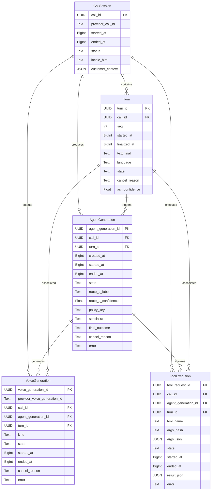

# Data Model Documentation

This document describes the data model for the Voice AI Runtime, including entity descriptions, field definitions, relationships, and an entity-relationship diagram.

## Model Descriptions

### 1. CallSession
Represents a single voice call handled by the runtime.

**Fields:**
- `call_id`: UUID primary key
- `provider_call_id`: External telephony provider call identifier (optional)
- `started_at`: Epoch milliseconds when the call started
- `ended_at`: Epoch milliseconds when the call ended (nullable)
- `status`: Call status (e.g. `active`, `completed`, `error`)
- `locale_hint`: Detected or configured locale (e.g. `es`, `en`)
- `customer_context`: JSON blob with caller metadata from CRM/IVR

**Indexes:**
- `ix_call_sessions_status` on `status`

**Relationships:**
- One-to-many with Turn
- One-to-many with AgentGeneration
- One-to-many with VoiceGeneration
- One-to-many with ToolExecution

### 2. Turn
Represents a single human speech turn within a call.

**Fields:**
- `turn_id`: UUID primary key
- `call_id`: FK to CallSession
- `seq`: Integer sequence number within the call (monotonically increasing)
- `started_at`: Epoch milliseconds when speech started
- `finalized_at`: Epoch milliseconds when transcript was finalized (nullable)
- `text_final`: Final transcript text (nullable)
- `language`: Detected language code (nullable)
- `state`: Turn state (`open`, `finalized`, `cancelled`)
- `cancel_reason`: Reason for cancellation if cancelled (nullable)
- `asr_confidence`: ASR confidence score (nullable)

**Indexes:**
- `ix_turns_call_id_seq` on `(call_id, seq)`

**Relationships:**
- Many-to-one with CallSession
- One-to-many with AgentGeneration

### 3. AgentGeneration
Represents a single agent classification and response generation cycle triggered by a finalized turn.

**Fields:**
- `agent_generation_id`: UUID primary key
- `call_id`: FK to CallSession
- `turn_id`: FK to Turn
- `created_at`: Epoch milliseconds
- `started_at`: Epoch milliseconds when processing began (nullable)
- `ended_at`: Epoch milliseconds when processing completed (nullable)
- `state`: Generation state (`pending`, `running`, `completed`, `cancelled`, `error`)
- `route_a_label`: Route A classification result (`simple`, `domain`, `disallowed`, `out_of_scope`) (nullable)
- `route_a_confidence`: Route A classification confidence score (nullable)
- `policy_key`: Policy key used for prompt construction (nullable)
- `specialist`: Route B specialist label if domain route (nullable)
- `final_outcome`: Final outcome description (nullable)
- `cancel_reason`: Reason for cancellation (`barge_in`, `rapid_successive_turn`) (nullable)
- `error`: Error message if failed (nullable)

**Indexes:**
- `ix_agent_generations_turn_id` on `turn_id`

**Relationships:**
- Many-to-one with CallSession
- Many-to-one with Turn
- One-to-many with VoiceGeneration
- One-to-many with ToolExecution

### 4. VoiceGeneration
Represents a single voice synthesis output sent to the caller.

**Fields:**
- `voice_generation_id`: UUID primary key
- `provider_voice_generation_id`: External voice provider identifier (nullable)
- `call_id`: FK to CallSession
- `agent_generation_id`: FK to AgentGeneration
- `turn_id`: FK to Turn
- `kind`: Voice generation type (`primary`, `filler`)
- `state`: Generation state (`pending`, `playing`, `completed`, `cancelled`, `error`)
- `started_at`: Epoch milliseconds (nullable)
- `ended_at`: Epoch milliseconds (nullable)
- `cancel_reason`: Reason for cancellation (nullable)
- `error`: Error message if failed (nullable)

**Indexes:**
- `ix_voice_generations_agent_generation_id` on `agent_generation_id`

**Relationships:**
- Many-to-one with CallSession
- Many-to-one with AgentGeneration
- Many-to-one with Turn

### 5. ToolExecution
Represents a single tool invocation during an agent generation cycle.

**Fields:**
- `tool_request_id`: UUID primary key
- `call_id`: FK to CallSession
- `agent_generation_id`: FK to AgentGeneration
- `turn_id`: FK to Turn
- `tool_name`: Name of the tool invoked
- `args_hash`: SHA256 hash of tool arguments (for idempotency/caching)
- `args_json`: JSON blob of tool arguments (nullable)
- `state`: Execution state (`pending`, `running`, `completed`, `cancelled`, `error`)
- `started_at`: Epoch milliseconds (nullable)
- `ended_at`: Epoch milliseconds (nullable)
- `result_json`: JSON blob of tool result (nullable)
- `error`: Error message if failed (nullable)

**Indexes:**
- `ix_tool_executions_agent_generation_id` on `agent_generation_id`

**Relationships:**
- Many-to-one with CallSession
- Many-to-one with AgentGeneration
- Many-to-one with Turn

## Entity Relationship Diagram

## Key Design Principles

1. **UUID Primary Keys**: All entities use UUIDs for distributed-safe identity without central sequence coordination.
2. **Epoch Milliseconds**: All timestamps are stored as BigInteger epoch milliseconds for consistent cross-timezone handling and easy arithmetic.
3. **Denormalized call_id**: Every child table carries `call_id` as a direct FK to enable efficient call-scoped queries without joins through intermediate tables.
4. **State Machines**: All entities with lifecycle (`Turn`, `AgentGeneration`, `VoiceGeneration`, `ToolExecution`) track explicit `state` and `cancel_reason` fields.
5. **Fire-and-Forget Persistence**: The runtime treats persistence as non-blocking — repo failures are logged but never crash the voice hot path.
